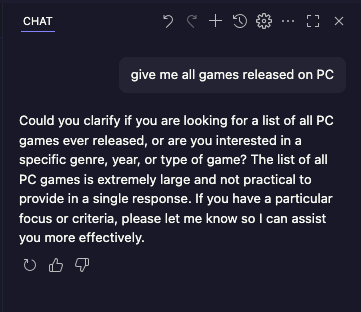
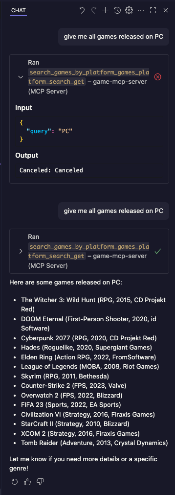

# 🎮 FastAPI Game Info Service (Powered by MCP)

A simple FastAPI application that allows users to store and search video game information such as title, genre, and platform. It also integrates with the **MCP (Model Control Plane)** for enhanced code intelligence.

---

## 🚀 Features

- Batch insert game records
- Search games by:
  - Title (case-insensitive, partial match)
  - Genre
  - Platform
- Integrated with Copilot MCP Server for smarter code suggestions

---

## 📦 Tech Stack

- **Backend**: FastAPI
- **Database**: MongoDB
- **Dev Tooling**: GitHub Copilot + MCP Server

---

## 🔧 Setup Instructions

### 📌 MCP Server Integration

This project uses GitHub Copilot MCP server for enhanced suggestions, structured context, and language-aware completions. Make sure your IDE is configured to point to your MCP server.

## 💬 Chat without MCP Integration

---

## 🤖 Chat with MCP Integration

